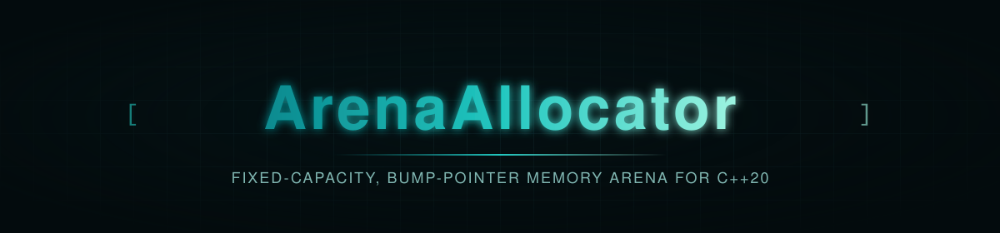

<p align="center">
  
</p>

<p align="center">
  
  
  
</p>

<p align="center">
  
</p>

<p align="center"><sub><b>CI / CD</b></sub></p>
<p align="center">
  <a href="https://github.com/privateMwb/ArenaAllocator/actions/workflows/build.yml">
    
  </a>
  <a href="https://github.com/privateMwb/ArenaAllocator/actions/workflows/benchmark.yml">
    
  </a>
  <a href="https://github.com/privateMwb/ArenaAllocator/actions/workflows/packaging.yml">
    
  </a>
  <a href="https://github.com/privateMwb/ArenaAllocator/actions/workflows/release.yml">
    
  </a>
</p>

<p align="center"><sub><b>Code Quality &amp; Safety</b></sub></p>
<p align="center">
  <a href="https://github.com/privateMwb/ArenaAllocator/actions/workflows/coverage.yml">
    
  </a>
  <a href="https://github.com/privateMwb/ArenaAllocator/actions/workflows/sanitizers.yml">
    
  </a>
  <a href="https://github.com/privateMwb/ArenaAllocator/actions/workflows/clang-tidy.yml">
    
  </a>
  <a href="https://github.com/privateMwb/ArenaAllocator/actions/workflows/clang-format.yml">
    
  </a>
  <a href="https://github.com/privateMwb/ArenaAllocator/actions/workflows/codeql.yml">
    
  </a>
  <a href="https://github.com/privateMwb/ArenaAllocator/actions/workflows/cflite_pr.yml">
    
  </a>
  <a href="https://www.bestpractices.dev/projects/14710">
    
  </a>
</p>

<p align="center"><sub><b>Documentation</b></sub></p>
<p align="center">
  <a href="https://github.com/privateMwb/ArenaAllocator/actions/workflows/docs.yml">
    
  </a>
</p>

<p align="center">
  
</p>

<p align="center"><sub><b>Compiler Support</b></sub></p>
<p align="center">
  
  
  
  
</p>

<p align="center">
  
</p>

<p align="center">ArenaAllocator is a header-only, fixed-capacity bump-pointer memory arena for modern C++ — O(1) allocation out of a single upfront buffer, nested frames with exception-safe RAII rollback, in-place object construction, and optional zero-overhead allocation statistics, so you only pay for the parts you actually use.</p>

<br>

## 📑 Table of Contents

- [Features](#features)
- [Requirements](#requirements)
- [Installation](#installation)
- [Quick Start](#quick-start)
- [Project Structure](#project-structure)
- [Development](#development)
- [Benchmarks](#benchmarks)
- [Fuzzing](#fuzzing)
- [Documentation](#documentation)
- [Contributing](#contributing)
- [Changelog](#changelog)
- [Security](#security)
- [License](#license)

<br>

## <a id="features"></a>✨ Features

- **Fixed-capacity, single-allocation buffer** — the arena owns one aligned buffer, allocated exactly once at construction. There is no growth, no chunking, and no further heap traffic for the lifetime of the arena. Running out of space is a plain bounds check and a `nullptr` return: no exceptions, no reallocation.
- **O(1), overflow-safe bump-pointer allocation** — `allocate()` resolves alignment with a bit-shift instead of a modulo/division path, validates that the aligned offset is still inside the buffer, and only then compares the request against the remaining capacity. `aligned + size` is never computed before it has been validated, so a request near `SIZE_MAX` fails cleanly instead of wrapping around.
- **Nested frames with RAII rollback** — `beginFrame()`/`endFrame()` open and close up to eight nested checkpoints, and `ArenaScope` ties a frame to a scope so it is rolled back on every exit path, including an exception. Rolling back a whole batch of allocations is O(1) and never touches them individually. `reset()` reclaims the entire buffer in O(1) too.
- **Zero-overhead optional statistics** — total, current, and peak usage plus the allocation count are tracked only when `EnableStats` is `true`. With it off, the statistics member is an empty `[[no_unique_address]]` type and every update site compiles away via `if constexpr`, so a plain arena carries no bookkeeping at all.
- **Typed storage and in-place construction** — `allocate<T>()` reserves correctly sized and aligned storage, and `create<T>(args...)` constructs a `T` in place with perfect forwarding, constrained to non-array types that are actually constructible from the arguments. If the allocation fails nothing is constructed; if the constructor throws, the arena is left unaffected. `destroy()` runs the destructor without pretending to return storage.
- **Alignment-aware, including over-aligned types** — every allocation can request its own power-of-two alignment, up to the base alignment the arena was constructed with (`alignof(std::max_align_t)` by default), which covers over-aligned types and cache-line or page-aligned blocks.
- **Contract-checked and movable** — preconditions are documented on every function and enforced with assert-driven contract macros, including one that runs *before* the buffer is allocated so a bad size never leaks it. Arenas are move-constructible and move-assignable; the source is left valid and empty.

<div align="right"><a href="#-table-of-contents"></a></div>

## <a id="requirements"></a>📋 Requirements

- A C++20-conformant compiler (tested: GCC, Clang, MSVC, AppleClang)
- CMake 3.20+

<div align="right"><a href="#-table-of-contents"></a></div>

## <a id="installation"></a>📦 Installation

**From source:**

```bash
git clone https://github.com/privateMwb/ArenaAllocator.git
cd ArenaAllocator
cmake -B build \
  -DBUILD_TESTS=OFF \
  -DBUILD_BENCHMARKS=OFF \
  -DBUILD_REGRESSION=OFF \
  -DBUILD_EXAMPLES=OFF
cmake --install build
```

Then, in your own `CMakeLists.txt`:

```cmake
find_package(ArenaPro CONFIG REQUIRED)
target_link_libraries(your_target PRIVATE ArenaPro::ArenaPro)
```

> vcpkg and Conan packages are built and verified (recipe in
> `packaging/recipes/arenapro/`, port in `packaging/vcpkg/ports/arenapro/`),
> but not yet published to the public registries. This section will be
> updated once they are.

<div align="right"><a href="#-table-of-contents"></a></div>

## <a id="quick-start"></a>🚀 Quick Start

```cpp
#include <ArenaPro/Arena.h>

#include <cstddef>

struct Particle {
    float x, y;
    Particle(float px, float py) : x{px}, y{py} {}
};

int main() {
    ArenaPro::Arena<> arena(64 * 1024, 64); // one 64 KiB buffer, 64-byte aligned

    // Raw, aligned storage — nullptr means the arena is out of space.
    std::byte* block = arena.allocate(256, 64);
    if (block == nullptr) {
        return 1;
    }

    // Typed storage, and in-place construction with perfect forwarding.
    int* slot = arena.allocate<int>();
    Particle* p = arena.create<Particle>(1.0f, 2.0f);

    arena.destroy(p); // runs ~Particle(); the bytes stay reserved until rollback
    arena.reset();    // reclaim the whole buffer in O(1)
}
```

Scoped, exception-safe rollback with `ArenaScope`:

```cpp
#include <ArenaPro/ArenaScope.h>

{
    ArenaPro::ArenaScope scope{arena}; // opens a frame

    std::byte* scratch = arena.allocate(4096);
    // ... use scratch ...
} // the frame closes here — scratch's storage is reclaimed in O(1),
  // even if an exception unwound the scope
```

Optional allocation statistics, and a clean failure when the arena is full:

```cpp
ArenaPro::Arena<true> tracked(4096);

(void)tracked.allocate(100);
(void)tracked.allocate(28);

const auto& stats = tracked.getStats();
std::cout << stats.allocations_ << " allocations, "
          << stats.totalAllocated_ << " bytes, peak "
          << stats.peakUsed_ << '\n';

ArenaPro::Arena<> small(64);
if (small.allocate(128) == nullptr) {
    std::cerr << "out of space\n"; // no exception, no reallocation
}
```

<div align="right"><a href="#-table-of-contents"></a></div>

## <a id="project-structure"></a>🗂️ Project Structure

```
ArenaAllocator/
├── include/
│   └── ArenaPro/
│       ├── Arena.h
│       ├── Arena.tpp
│       ├── ArenaScope.h
│       └── Contract.h
│
├── tests/
│   ├── custom/
│   ├── google/
│   ├── CMakeLists.txt
│   └── README.md
│
├── benchmarks/
│   ├── baselines/
│   ├── custom/
│   ├── google/
│   ├── results/
│   ├── CMakeLists.txt
│   └── README.md
│
├── examples/
│   ├── support/
│   ├── suite/
│   ├── example_main.cpp
│   ├── CMakeLists.txt
│   └── README.md
│
├── regression/
│   ├── custom/
│   ├── google/
│   ├── results/
│   ├── CMakeLists.txt
│   └── README.md
│
├── fuzz/
│   └── fuzz_arena.cpp
│
├── .clusterfuzzlite/
│   ├── Dockerfile
│   ├── build.sh
│   └── project.yaml
│
├── packaging/
│   ├── README.md
│   ├── requirements.in
│   ├── requirements.txt
│   ├── recipes/
│   ├── vcpkg/
│   └── vcpkg-smoke-test/
│
├── scripts/
│   └── update_package_files.py
│
├── .github/
│   ├── assets/
│   ├── releases/
│   ├── workflows/
│   ├── CODEOWNERS
│   └── dependabot.yml
│
├── cmake/
│   └── ArenaProConfig.cmake.in
│
├── docs/
│   ├── Doxyfile
│   └── README.md
│
├── .clang-format
├── .clang-tidy
├── .gitignore
├── CMakeLists.txt
├── README.md
├── CONTRIBUTING.md
├── CHANGELOG.md
├── SECURITY.md
├── FUZZING.md
└── LICENSE
```

<div align="right"><a href="#-table-of-contents"></a></div>

## <a id="development"></a>🛠️ Development

The from-source install above builds the library only. To work on
ArenaAllocator itself — running tests, benchmarks, or the regression tool —
build with everything enabled (the default):

```bash
cmake -B build
cmake --build build
```

**Run the test suite:**

```bash
ctest --test-dir build
```

**Run benchmarks and check for regressions:**

```bash
./build/benchmarks
./build/regression                  # latest baseline vs. benchmarks/results/benchmark_results.json
./build/regression v1.2.0           # a specific baseline vs. current
./build/regression v1.2.0 v1.4.0    # two baselines against each other
```

`regression` picks the latest baseline by semantic version (`v1.10.0`
correctly outranks `v1.9.0`), not alphabetical filename order, and
auto-names its output (`regression_v1.2.0_vs_current.md`/`.json`, etc.).

See [packaging/README.md](packaging/README.md) for notes on verifying the vcpkg
port and Conan recipe locally.

<div align="right"><a href="#-table-of-contents"></a></div>

## <a id="benchmarks"></a>📊 Benchmarks

Measured against `stdArena` (a naive `new[]` + linear-scan baseline), same
build, at 10K / 100K / 1M iterations (`benchmarks/baselines/v1.0.0.json`
has the full dataset).

*Environment: Release build — see the `context` block in
`benchmarks/baselines/v1.0.0.json` for the exact machine and library
version each run was captured on.*

| Operation | ArenaPro (1M) | stdArena (1M) | Δ |
|---|---|---|---|
| `Allocate()` at capacity (failure path) | 308.34 us | 1.76 s | +569727.4% |
| `Reset()` + refill | 101.67 ms | 14.16 s | +13825.6% |
| `Allocate<T>()` large type | 821.41 us | 1.63 ms | +98.2% |
| `Allocate()` large | 680.08 us | 1.27 ms | +86.9% |
| `Allocate()` over-aligned | 770.38 us | 1.27 ms | +64.8% |
| `Create<T>()` non-trivial | 3.03 ms | 3.84 ms | +26.6% |
| `Allocate()` 4096-byte aligned | 1.41 ms | 1.76 ms | +24.6% |
| `Allocate()` small | 1.11 ms | 1.30 ms | +17.2% |
| `Destroy<T>()` trivial | 320.11 us | 308.32 us | -3.7% |
| `Allocate()` 4 KiB buffer | 2.66 ms | 2.04 ms | -23.3% |
| `Construction` | 40.12 ms | 7.47 ms | -81.4% |

ArenaPro's fixed-buffer, bump-pointer design pays off most on the
exhaustion path (a bounds check and a `nullptr` return versus `stdArena`
actually growing), bulk churn (`reset()` + refill), and large or
over-aligned allocations, where `stdArena`'s per-call bookkeeping shows up
directly.

The trade-off: the buffer is allocated once, eagerly and aligned, at
construction — so `Construction` is consistently slower than `stdArena`'s
lazy setup, and small buffers (`Allocate()` 4 KiB buffer) don't fully
amortize that upfront alignment cost the way larger buffers do.

<div align="right"><a href="#-table-of-contents"></a></div>

## <a id="fuzzing"></a>🐛 Fuzzing

`Arena` is continuously fuzzed via
[ClusterFuzzLite](https://google.github.io/clusterfuzzlite/):
differential testing against an independent shadow model, under
AddressSanitizer and UndefinedBehaviorSanitizer. A short pass runs on
every PR touching the library's implementation; a longer pass runs
nightly.

The shadow model re-derives the bump-pointer math with plain modulo
arithmetic instead of `Arena`'s shift/mask formulation, and every
allocation is checked for the exact address it must land on. This covers
the capacity boundary (exact fit, zero-size, and near-`SIZE_MAX`
requests), alignment across every power of two, `create<T>()`/`destroy()`
lifecycle, nested frames and `ArenaScope` rollback, `reset()`, move
construction and assignment including self-move, and the statistics —
each input runs against both `Arena<true>` and `Arena<false>`. A throwing
constructor inside `create()` and constructor failure aren't covered
yet — see [FUZZING.md](FUZZING.md) for full scope, running locally, and
reproducing a failing input.

<div align="right"><a href="#-table-of-contents"></a></div>

## <a id="documentation"></a>📖 Documentation

Full API reference, generated with Doxygen from `docs/Doxyfile`:

**https://privateMwb.github.io/ArenaAllocator/**

<div align="right"><a href="#-table-of-contents"></a></div>

## <a id="contributing"></a>🤝 Contributing

Issues and pull requests are welcome — see [CONTRIBUTING.md](CONTRIBUTING.md)
for the full process, coding standard reference, and what CI checks on
every PR. Short version, before submitting:

- Run the test suite (`ctest --test-dir build`)
- If you're changing a hot path, run `./build/regression` and mention
  the results in your PR description

<div align="right"><a href="#-table-of-contents"></a></div>

## <a id="changelog"></a>📝 Changelog

See [CHANGELOG.md](CHANGELOG.md) for a curated, per-release summary of
changes, or the [Releases](https://github.com/privateMwb/ArenaAllocator/releases)
page for the full release notes.

<div align="right"><a href="#-table-of-contents"></a></div>

## <a id="security"></a>🔒 Security

See [SECURITY.md](SECURITY.md) for the supported versions, how to report
a vulnerability (including privately, via GitHub Security Advisories),
and the disclosure timeline.

<div align="right"><a href="#-table-of-contents"></a></div>

## <a id="license"></a>📄 License

MIT — see [LICENSE](LICENSE) for details.

<p align="center">
  <sub>Built with C++20</sub>
</p>

<p align="center">
  <a href="#-table-of-contents"></a>
</p>
